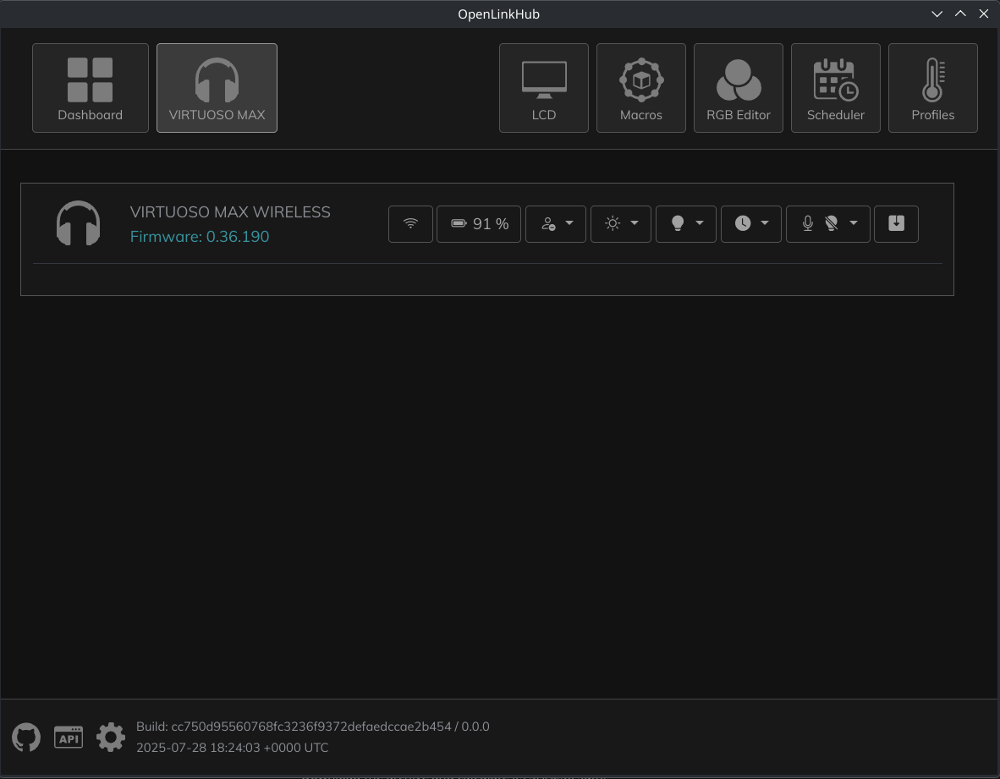

# OpenLinkHub-PyQT
To be used together with OpenLinkHub https://github.com/jurkovic-nikola/OpenLinkHub

This app loads OpenLinkHub in a QT app instead of a browser tab.
Also comes with a simple tray icon to open and close the app.


# Requirements
```
Python >= 3.9
PyQT6 >= 6.9.1
PyQt6-WebEngine >= 6.9.0
```

# Environment variables
If you use the default url for OpenLinkHub you don't need to set anything. 
Otherwise, set this env var to your OpenLinkHub url:

```
OLH_URL=http://localhost:27003
```

Other env vars
```
OLH_START_MINIMIZED=1 # Useful if you autostart the app on boot
OLH_ICON_PATH=/some/path/to/other/tray-icon.png
```

# Running the app

```commandline
python openlinkhub_qt.py &
```
If you want to start it minimized:
```commandline
OLH_START_MINIMIZED=1 python openlinkhub_qt.py &
```
